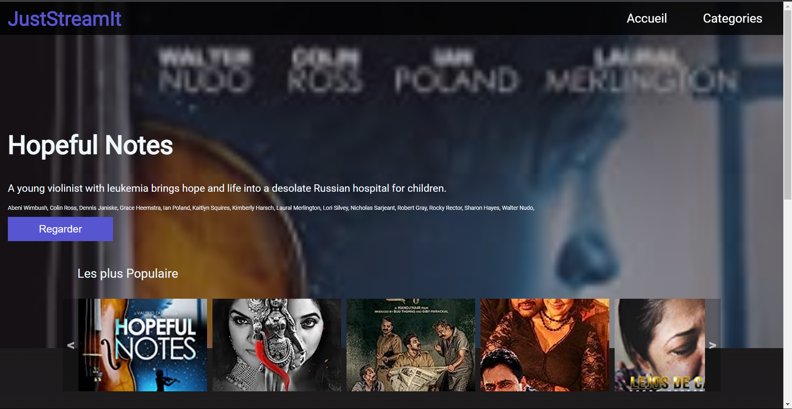
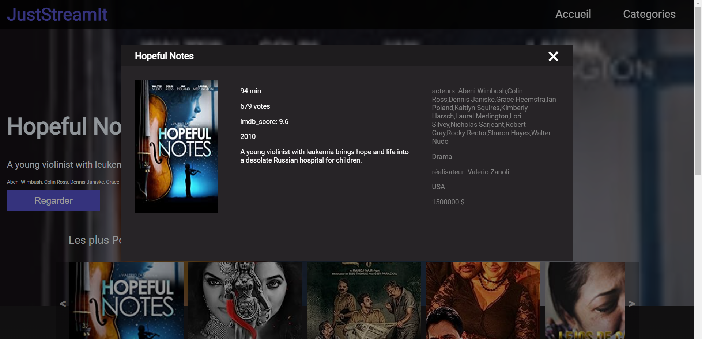

# Python_P6_Thomas_Supligeon

# JustStreamIt

JustStreamIt est une application web qui permet de visualiser en temps réel un classement de films intéressants. L'objectif de ce projet est de développer un site web pour l'association JustStreamIt, connue pour ses newsletters de classement de films.

## Fonctionnalités

- Affichage en temps réel d'un classement de films intéressants
- Filtrage des films par catégories personnalisées
- Affichage du film le mieux noté toutes catégories confondues
- Affichage des 7 autres films les mieux notés toutes catégories confondues
- Affichage des 7 films les mieux notés d'une catégorie donnée
- Fenêtre modale avec les détails d'un film lors du clic sur le bouton ou l'image du film

## Captures d'écran


*Page d'accueil affichant le classement de films*


*Fenêtre modale affichant les détails d'un film*

## Installation

1. Clonez le dépôt GitHub du site vers votre machine locale :
   ```
   git clone https://github.com/tsuplige/Python_P6_Thomas_Supligeon.git
   ```
3. Accédez au répertoire du projet :
   ```
   cd Python_P6_Thomas_Supligeont
   ```

2. Clonez le dépôt GitHub de l'API vers votre machine locale :
   ```
   git clone https://github.com/OpenClassrooms-Student-Center/OCMovies-API-EN-FR.git
   ```

3. Suivez les instructions du ReadME de l'API pour l'installation de celle-ci :
   ```
   git clone https://github.com/OpenClassrooms-Student-Center/OCMovies-API-EN-FR.git
   ```

4. Ouvrez le fichier index.html dans votre navigateur web préféré.

## Utilisation

- Le classement de films est affiché sur la page d'accueil.
- Utilisez les flèches de défilement pour parcourir les différents films dans la section "Films les mieux notés" ou dans les catégories personnalisées.
- Cliquez sur le bouton ou l'image d'un film pour ouvrir une fenêtre modale avec les détails du film.
- Utilisez le bouton de fermeture pour refermer la fenêtre modale.

## Technologies utilisées

- HTML5
- CSS3
- JavaScript (Vanilla)

## Contributeurs

- [Thomas Supligeon](https://github.com/tsuplige)

## Remarques

- Ce projet utilise l'API OCMovies pour récupérer les données des films. Assurez-vous que l'API est en cours d'exécution avant d'utiliser l'application.
- Aucun framework CSS (comme Bootstrap) n'est utilisé dans ce projet. Toutes les styles sont écrites en CSS pur.
